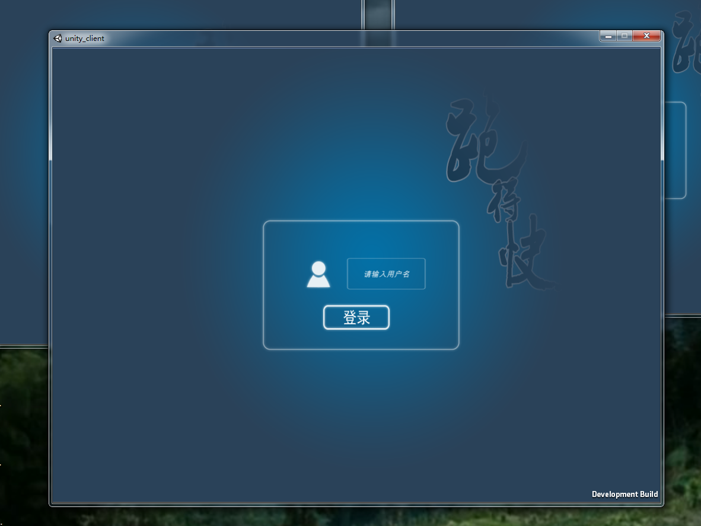
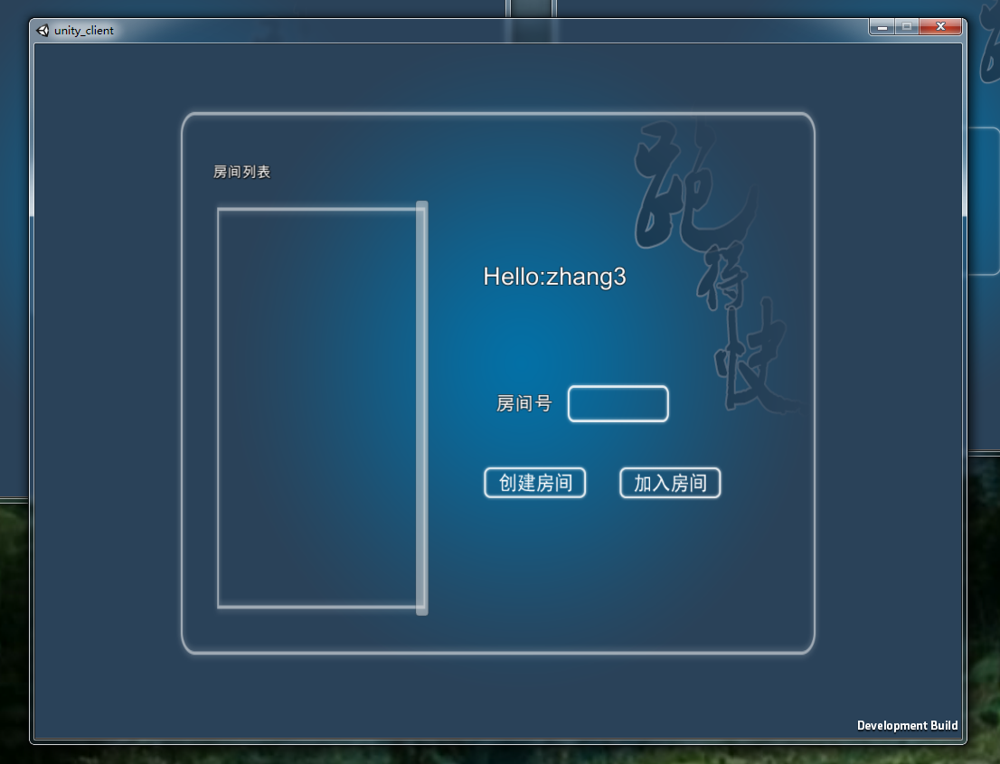
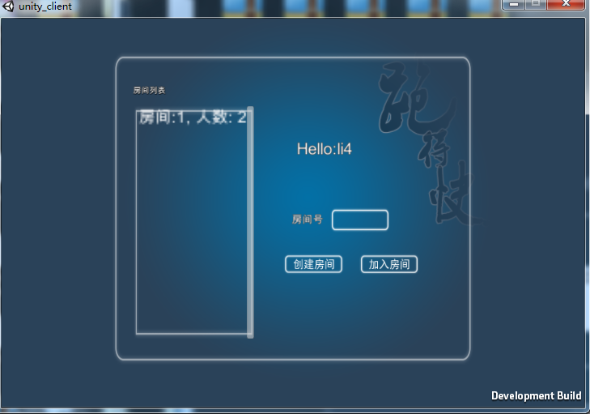
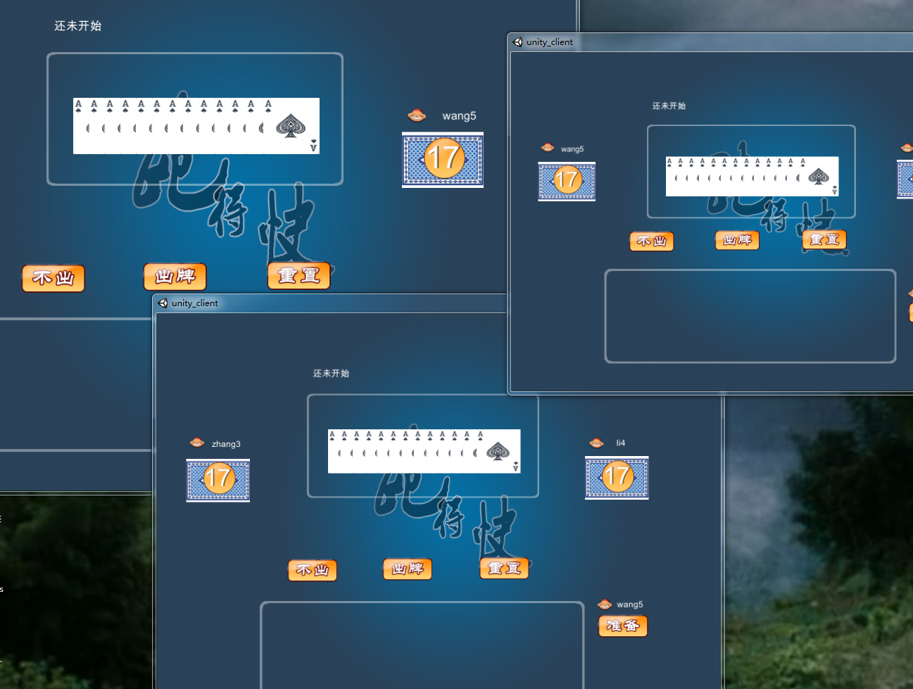
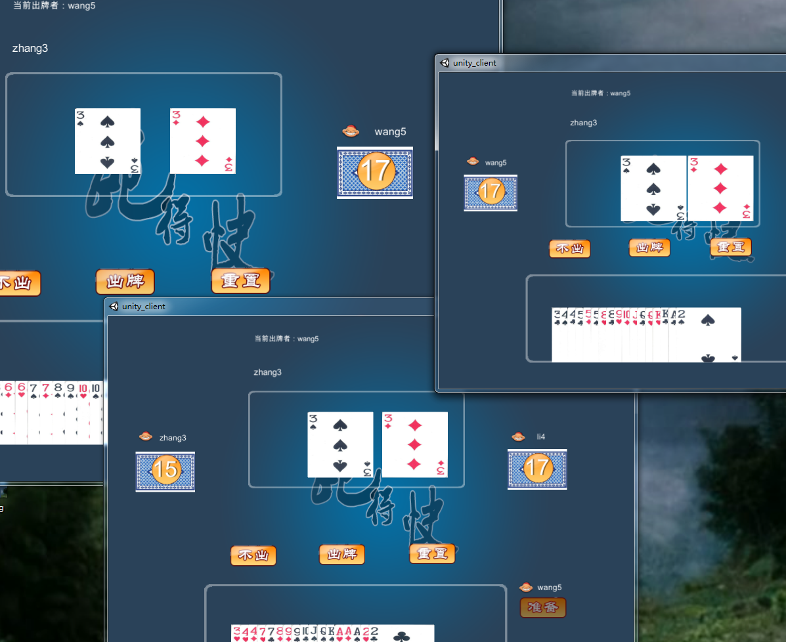

NetEase pomelo服务端，unity5.4相关版本客户端，实现3个人的"跑的快"棋牌联机游戏

---

测试环境
====
* win7 unity 5.4.1

* nodejs 5.8.0

* pomelo 1.2.3

windows下pomelo game-server 下的npm install modules可能由于版本出错
下面的仓库地址，git直接上传了modules, 所以直接clone,运行服务端

https://github.com/wxy8961230/pomelo_unity_ChessOfRunFast

程序截图
===
部分截图，具体要联系代码看

扩展
===

* 界面优化

* 各种异常处理，登录退出处理

* 可以添加房间人数

* 可以加上聊天，分数等

开发者及其github
===

* 丁文龙

https://github.com/doctording

* 王晓瑶

https://github.com/wxy8961230
